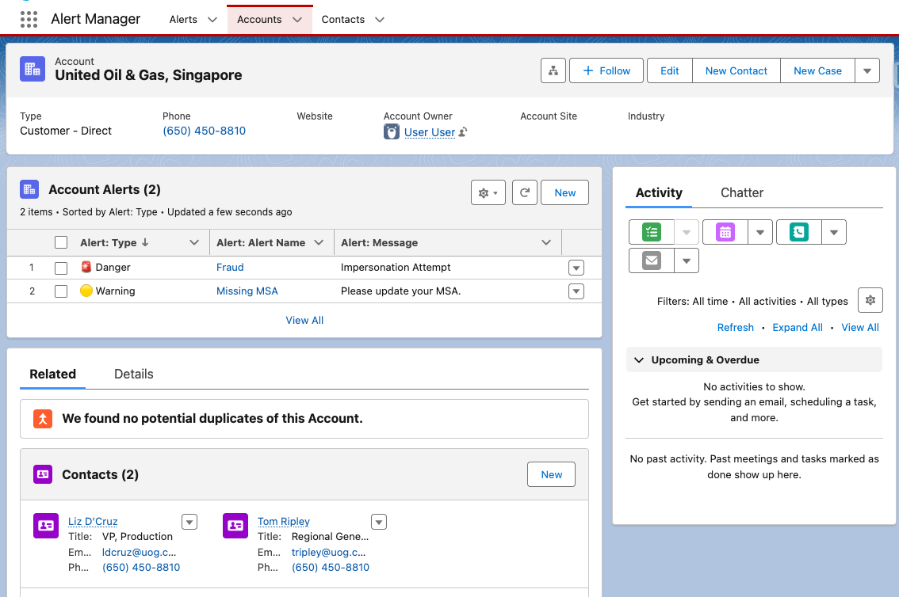
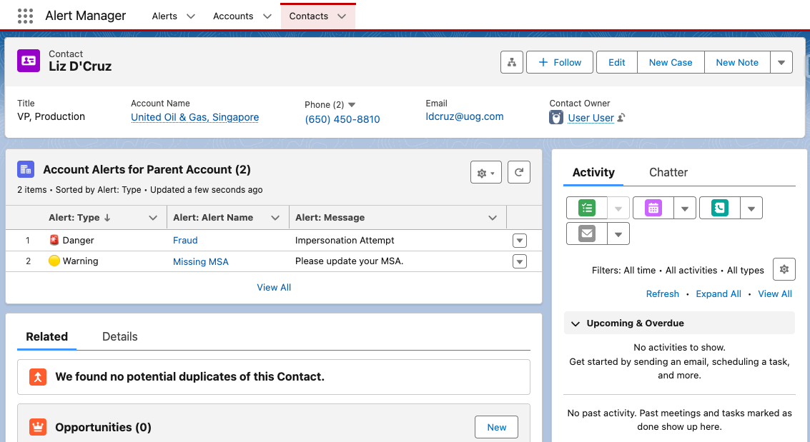

# Alerts

Use Permission Sets to grant this Alerts App to a group of users so they can assign and manage alerts to Accounts in Salesforce.

If Accounts have Alerts, display the Alerts on any Account related record page that you like.

See the examples folder for how to configure Account Alerts on Account or Contact record pages.

## Alerts on an Account Record Page

## Account Alerts on a Contact Record Page

